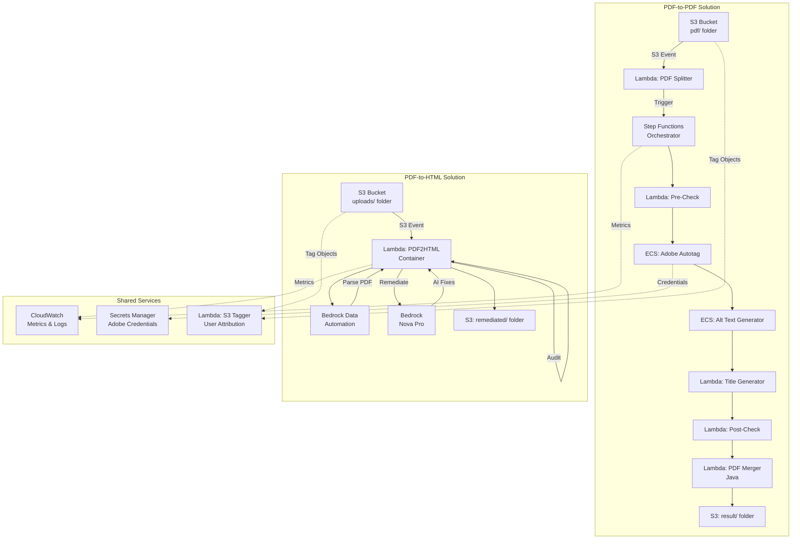
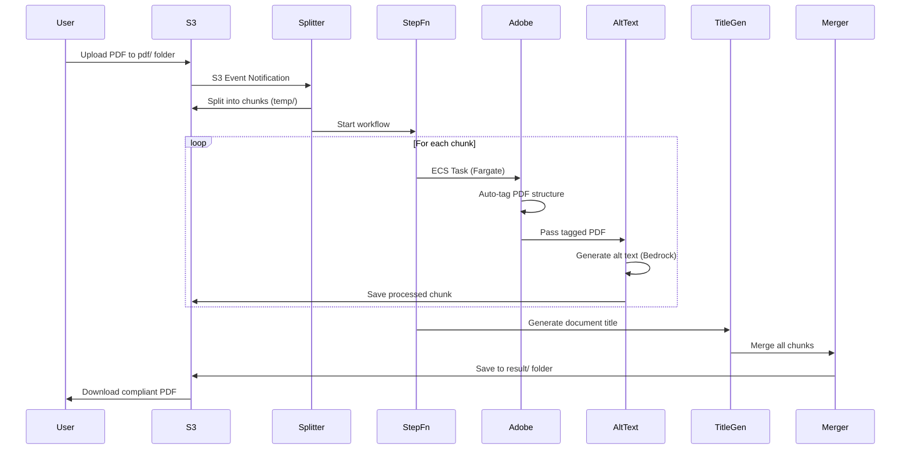
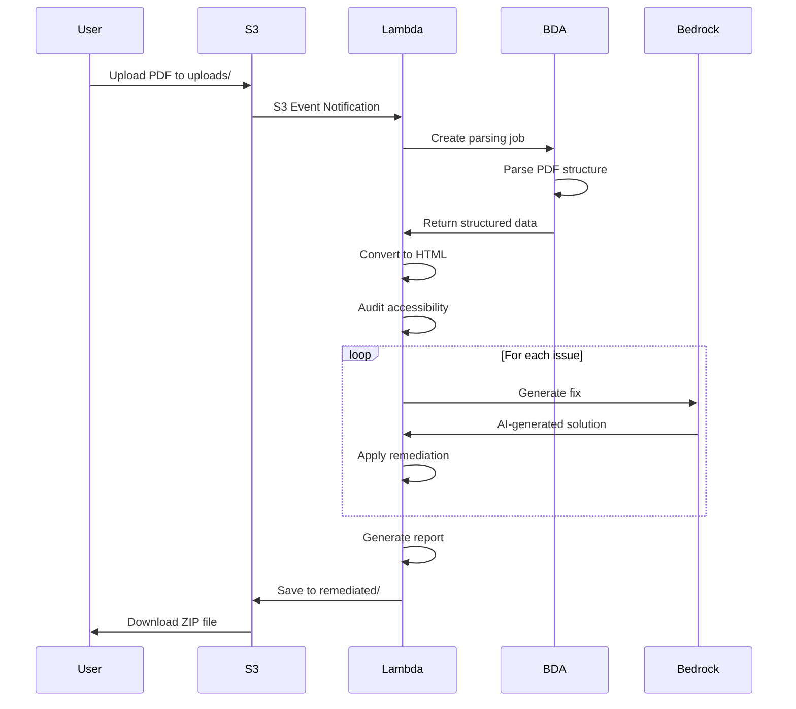
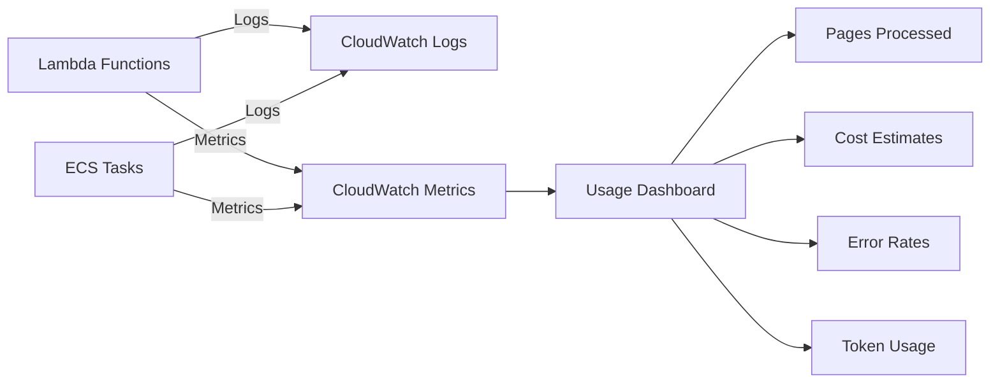
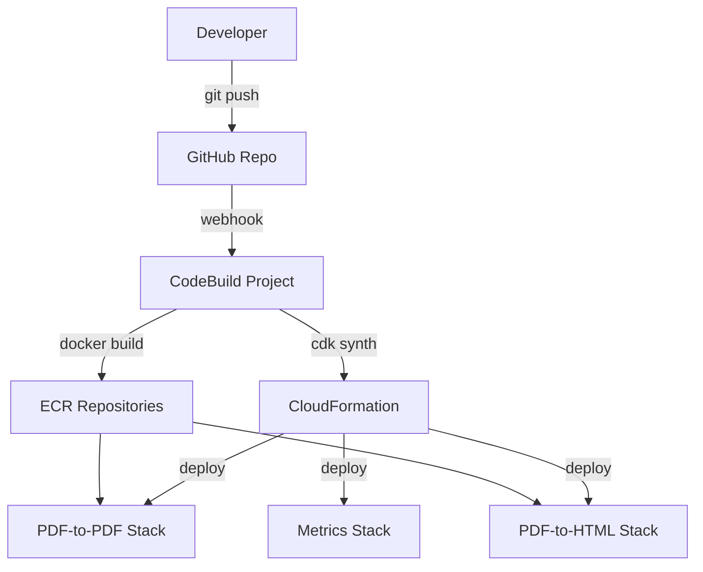

# System Architecture

## High-Level Overview

The PDF Accessibility Solutions system provides two independent but complementary approaches to making PDF documents accessible:

1. **PDF-to-PDF Remediation**: Maintains PDF format while adding accessibility features
2. **PDF-to-HTML Remediation**: Converts PDFs to accessible HTML

Both solutions are serverless, event-driven architectures deployed on AWS.

## Architecture Diagram



## PDF-to-PDF Solution Architecture

### Workflow



### Components

#### 1. PDF Splitter Lambda
- **Runtime**: Python 3.12
- **Trigger**: S3 PUT event on `pdf/` folder
- **Function**: Splits large PDFs into manageable chunks (pages)
- **Output**: Individual page PDFs in `temp/` folder
- **Metrics**: Pages processed, file sizes

#### 2. Step Functions Orchestrator
- **Type**: Standard workflow
- **Purpose**: Coordinates parallel processing of PDF chunks
- **Features**:
  - Parallel execution for multiple chunks
  - Error handling and retries
  - Progress tracking
- **Timeout**: Configurable (default: 1 hour)

#### 3. Adobe Autotag ECS Task
- **Platform**: ECS Fargate
- **Container**: Python-based
- **Function**: 
  - Calls Adobe PDF Services API
  - Adds PDF structure tags (headings, lists, tables)
  - Extracts images and metadata
- **API**: Adobe PDF Extract API
- **Credentials**: Stored in Secrets Manager

#### 4. Alt Text Generator ECS Task
- **Platform**: ECS Fargate
- **Container**: Node.js-based
- **Function**:
  - Generates alt text for images using Bedrock
  - Embeds alt text into PDF structure
  - Uses vision-capable models
- **Model**: Amazon Nova Pro (multimodal)

#### 5. Title Generator Lambda
- **Runtime**: Python 3.12
- **Function**: Generates descriptive PDF title using Bedrock
- **Model**: Amazon Nova Pro
- **Input**: PDF text content
- **Output**: Metadata with generated title

#### 6. PDF Merger Lambda
- **Runtime**: Java 11
- **Function**: Merges processed chunks into single PDF
- **Library**: Apache PDFBox
- **Output**: Final compliant PDF with "COMPLIANT" prefix

#### 7. Accessibility Checkers
- **Pre-Remediation**: Audits original PDF
- **Post-Remediation**: Validates compliance
- **Output**: JSON reports with WCAG issues

### Infrastructure

#### VPC Configuration
- **Subnets**: Public and Private with NAT Gateway
- **VPC Endpoints**: ECR, ECR Docker, S3 (reduces cold start by 10-15s)
- **Security**: Private subnets for ECS tasks

#### ECS Cluster
- **Launch Type**: Fargate
- **CPU**: 2 vCPU (configurable)
- **Memory**: 4 GB (configurable)
- **Networking**: Private subnets with NAT egress

#### S3 Bucket Structure
```
pdfaccessibility-{id}/
├── pdf/              # Input PDFs (trigger)
├── temp/             # Intermediate chunks
└── result/           # Final compliant PDFs
```

## PDF-to-HTML Solution Architecture

### Workflow



### Components

#### 1. PDF2HTML Lambda Function
- **Runtime**: Python 3.12 (container)
- **Trigger**: S3 PUT event on `uploads/` folder
- **Timeout**: 15 minutes
- **Memory**: 3 GB
- **Container**: Custom Docker image with dependencies

#### 2. Bedrock Data Automation (BDA)
- **Service**: AWS Bedrock Data Automation
- **Function**: 
  - Parses PDF structure (text, images, tables)
  - Extracts layout information
  - Identifies document elements
- **Output**: Structured JSON with page elements

#### 3. Accessibility Auditor
- **Module**: `audit/auditor.py`
- **Checks**: 
  - WCAG 2.1 Level AA criteria
  - Document structure (headings, landmarks)
  - Images (alt text, decorative vs. informative)
  - Forms (labels, fieldsets)
  - Tables (headers, captions, scope)
  - Links (descriptive text)
  - Color contrast
- **Output**: Detailed issue list with locations

#### 4. Remediation Engine
- **Module**: `remediate/remediation_manager.py`
- **Strategies**:
  - Image remediation (alt text generation)
  - Heading hierarchy fixes
  - Table structure improvements
  - Form label associations
  - Landmark additions (main, nav, header, footer)
  - Link text improvements
  - Color contrast adjustments
- **AI Integration**: Bedrock Nova Pro for complex fixes

#### 5. Report Generator
- **Formats**: HTML, JSON, CSV, TXT
- **Content**:
  - Issues found and fixed
  - WCAG criteria mapping
  - Before/after comparisons
  - Usage statistics (tokens, API calls, costs)

### Infrastructure

#### Lambda Container
- **Base Image**: `public.ecr.aws/lambda/python:3.12`
- **Dependencies**: 
  - `beautifulsoup4`, `lxml` (HTML parsing)
  - `boto3` (AWS SDK)
  - `Pillow` (image processing)
  - Custom accessibility utility library

#### S3 Bucket Structure
```
pdf2html-bucket-{id}/
├── uploads/          # Input PDFs (trigger)
├── output/           # Temporary processing files
└── remediated/       # Final ZIP files
    └── final_{filename}.zip
        ├── remediated.html
        ├── result.html
        ├── images/
        ├── remediation_report.html
        └── usage_data.json
```

## Shared Infrastructure

### CloudWatch Monitoring



#### Custom Metrics Namespace: `PDFAccessibility`

**Metrics Published**:
- `PagesProcessed`: Total pages remediated
- `AdobeAPICalls`: Adobe API invocations
- `BedrockInvocations`: Bedrock API calls
- `BedrockTokensUsed`: Input/output tokens
- `ProcessingDuration`: End-to-end time
- `ErrorCount`: Failures by type
- `FileSizeBytes`: Input/output file sizes
- `EstimatedCost`: Per-user cost tracking

**Dimensions**:
- `Solution`: `PDF2PDF` or `PDF2HTML`
- `UserId`: Cognito user ID (from S3 tags)
- `Operation`: Specific operation type

### S3 Object Tagging
- **Lambda**: `s3_object_tagger`
- **Purpose**: Attribute usage to individual users
- **Tags**: `user-id`, `upload-timestamp`
- **Integration**: Cognito user pools (when UI deployed)

### Secrets Manager
- **Secret**: `adobe-pdf-services-credentials`
- **Contents**: 
  - `client_id`: Adobe API client ID
  - `client_secret`: Adobe API client secret
- **Access**: Adobe Autotag ECS task only

## Design Patterns

### Event-Driven Architecture
- S3 events trigger processing pipelines
- Loose coupling between components
- Asynchronous processing

### Serverless-First
- Lambda for lightweight operations
- ECS Fargate for heavy processing
- No server management

### Infrastructure as Code
- AWS CDK for all resources
- Version-controlled infrastructure
- Repeatable deployments

### Observability
- Comprehensive CloudWatch logging
- Custom metrics for business KPIs
- Cost tracking per user

### Security
- Least privilege IAM roles
- VPC isolation for ECS tasks
- Secrets Manager for credentials
- SSL/TLS enforcement on S3

## Scalability Considerations

### PDF-to-PDF
- **Parallel Processing**: Step Functions processes chunks concurrently
- **ECS Auto-scaling**: Fargate scales based on task count
- **Bottleneck**: Adobe API rate limits

### PDF-to-HTML
- **Lambda Concurrency**: Configurable (default: 10)
- **BDA Limits**: Project-level quotas
- **Bedrock Throttling**: Model-specific limits

### Cost Optimization
- **VPC Endpoints**: Reduce data transfer costs
- **zstd Compression**: Faster container startup (2-3x vs gzip)
- **Spot Instances**: Not used (Fargate on-demand for reliability)
- **S3 Lifecycle**: Automatic cleanup of temp files (optional)

## Deployment Architecture



### Deployment Options
1. **One-Click**: `deploy.sh` script (CloudShell)
2. **CodeBuild**: Automated CI/CD pipeline
3. **Manual**: `cdk deploy` commands
4. **Local**: `deploy-local.sh` for development

## Disaster Recovery

### Backup Strategy
- **S3 Versioning**: Enabled on all buckets
- **CloudFormation**: Infrastructure recreatable from code
- **Secrets**: Backed up in Secrets Manager

### Recovery Time Objective (RTO)
- **Infrastructure**: ~15 minutes (CDK redeploy)
- **Data**: Immediate (S3 versioning)

### Recovery Point Objective (RPO)
- **Processing State**: Lost (stateless architecture)
- **Input Files**: Zero data loss (S3 durability)
