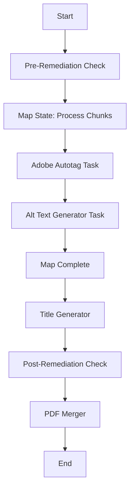
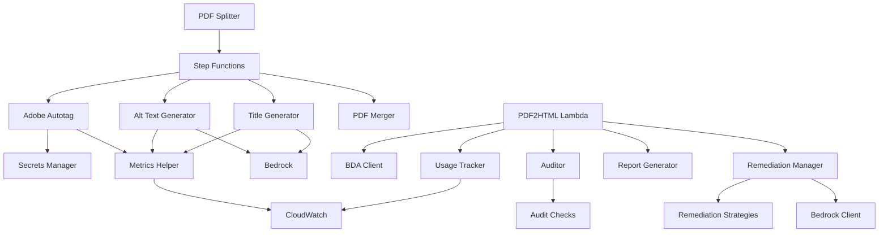

# System Components

## Component Catalog

This document provides detailed information about each major component in the PDF Accessibility Solutions system.

## PDF-to-PDF Solution Components

### 1. PDF Splitter Lambda

**Location**: `lambda/pdf-splitter-lambda/main.py`

**Purpose**: Splits large PDF files into individual pages for parallel processing.

**Key Functions**:
- `lambda_handler()`: Entry point, processes S3 events
- `split_pdf_into_pages()`: Splits PDF using pypdf library
- `log_chunk_created()`: Tracks chunk creation metrics

**Dependencies**:
- `pypdf`: PDF manipulation
- `boto3`: S3 operations
- `metrics_helper`: CloudWatch metrics

**Metrics Published**:
- `PagesProcessed`: Number of pages split
- `FileSizeBytes`: Input file size
- `ProcessingDuration`: Split operation time

**Triggers**: S3 PUT event on `pdf/` folder

**Output**: Individual page PDFs in `temp/` folder with naming pattern: `{original_name}_page_{n}.pdf`

**Error Handling**: 
- Retries with exponential backoff
- Logs errors to CloudWatch
- Publishes error metrics

---

### 2. Adobe Autotag Container

**Location**: `adobe-autotag-container/adobe_autotag_processor.py`

**Purpose**: Adds accessibility tags to PDFs using Adobe PDF Services API.

**Key Functions**:
- `main()`: Entry point for ECS task
- `autotag_pdf_with_options()`: Calls Adobe API
- `extract_api()`: Extracts images and structure
- `add_toc_to_pdf()`: Adds table of contents
- `set_language_comprehend()`: Detects document language
- `extract_images_from_extract_api()`: Extracts images for alt text

**Adobe API Operations**:
- **Autotag**: Adds structure tags (headings, paragraphs, lists, tables)
- **Extract**: Extracts images, text, and layout information

**Dependencies**:
- `adobe.pdfservices.operation`: Adobe SDK
- `boto3`: S3 and Secrets Manager
- `openpyxl`: Excel parsing for image metadata
- `sqlite3`: Image metadata database

**Configuration**:
- Credentials from Secrets Manager
- Language detection via AWS Comprehend
- Configurable tagging options

**Metrics**:
- Adobe API calls
- Processing duration
- File sizes
- Error tracking

**Container Specs**:
- **Base Image**: `python:3.9-slim`
- **CPU**: 2 vCPU
- **Memory**: 4 GB
- **Timeout**: 30 minutes

---

### 3. Alt Text Generator Container

**Location**: `alt-text-generator-container/alt_text_generator.js`

**Purpose**: Generates alt text for images using Amazon Bedrock.

**Key Functions**:
- `startProcess()`: Entry point
- `modifyPDF()`: Embeds alt text into PDF
- `generateAltText()`: Calls Bedrock for image description
- `generateAltTextForLink()`: Handles linked images

**AI Model**: Amazon Nova Pro (multimodal vision model)

**Process**:
1. Reads PDF with existing tags
2. Identifies images without alt text
3. Extracts image context (surrounding text)
4. Generates descriptive alt text via Bedrock
5. Embeds alt text into PDF structure
6. Saves modified PDF

**Dependencies**:
- `pdf-lib`: PDF manipulation
- `@aws-sdk/client-bedrock-runtime`: Bedrock API
- `@aws-sdk/client-s3`: S3 operations

**Prompt Engineering**:
- Includes image context from surrounding text
- Distinguishes decorative vs. informative images
- Generates concise, descriptive alt text

**Container Specs**:
- **Base Image**: `node:18-alpine`
- **CPU**: 2 vCPU
- **Memory**: 4 GB
- **Timeout**: 30 minutes

---

### 4. Title Generator Lambda

**Location**: `lambda/title-generator-lambda/title_generator.py`

**Purpose**: Generates descriptive PDF titles using AI.

**Key Functions**:
- `lambda_handler()`: Entry point
- `generate_title()`: Calls Bedrock for title generation
- `extract_text_from_pdf()`: Extracts text using PyMuPDF
- `set_custom_metadata()`: Embeds title in PDF metadata

**AI Model**: Amazon Nova Pro

**Process**:
1. Extracts first few pages of text
2. Sends to Bedrock with prompt
3. Receives generated title
4. Embeds in PDF metadata
5. Saves updated PDF

**Prompt**: Instructs model to create concise, descriptive title based on content

**Dependencies**:
- `pymupdf (fitz)`: PDF text extraction
- `pypdf`: PDF metadata modification
- `boto3`: S3 and Bedrock

**Metrics**: Bedrock invocations, token usage, processing time

---

### 5. PDF Merger Lambda

**Location**: `lambda/pdf-merger-lambda/PDFMergerLambda/src/main/java/com/example/App.java`

**Purpose**: Merges processed PDF chunks into single compliant PDF.

**Key Functions**:
- `handleRequest()`: Lambda entry point
- `downloadPDF()`: Downloads chunks from S3
- `mergePDFs()`: Merges using Apache PDFBox
- `uploadPDF()`: Uploads final PDF

**Technology**: Java 11 with Apache PDFBox

**Process**:
1. Receives list of processed chunks
2. Downloads all chunks from S3
3. Merges in correct page order
4. Adds "COMPLIANT" prefix to filename
5. Uploads to `result/` folder

**Dependencies**:
- `org.apache.pdfbox:pdfbox`: PDF merging
- `com.amazonaws:aws-lambda-java-core`: Lambda runtime
- `software.amazon.awssdk:s3`: S3 operations

**Memory**: 1 GB  
**Timeout**: 5 minutes

---

### 6. Pre/Post Remediation Accessibility Checkers

**Locations**: 
- `lambda/pre-remediation-accessibility-checker/main.py`
- `lambda/post-remediation-accessibility-checker/main.py`

**Purpose**: Audit PDF accessibility before and after remediation.

**Key Functions**:
- `lambda_handler()`: Entry point
- Calls external accessibility checking service/library
- Generates JSON report with WCAG issues

**Output**: JSON file with:
- List of accessibility issues
- WCAG criteria violations
- Issue severity levels
- Suggested fixes

**Use Case**: 
- Pre-check: Baseline audit
- Post-check: Validation of remediation

---

### 7. Step Functions Orchestrator

**Definition**: Defined in `app.py` CDK stack

**Purpose**: Coordinates parallel processing of PDF chunks.

**Workflow**:


**Features**:
- **Map State**: Parallel execution of chunks
- **Error Handling**: Retry logic with exponential backoff
- **Timeouts**: Configurable per task
- **Logging**: CloudWatch Logs integration

**Configuration**:
- Max concurrency: 10 (configurable)
- Retry attempts: 3
- Backoff rate: 2.0

---

## PDF-to-HTML Solution Components

### 8. PDF2HTML Lambda Function

**Location**: `pdf2html/lambda_function.py`

**Purpose**: Converts PDFs to accessible HTML with full remediation.

**Key Functions**:
- `lambda_handler()`: Entry point, orchestrates entire pipeline
- Calls `process_pdf_accessibility()` from main API

**Pipeline Stages**:
1. **Conversion**: PDF → HTML via Bedrock Data Automation
2. **Audit**: Identify accessibility issues
3. **Remediation**: Fix issues using AI
4. **Report Generation**: Create detailed reports
5. **Packaging**: ZIP all outputs

**Dependencies**:
- `content_accessibility_utility_on_aws`: Core library
- `boto3`: AWS services
- `beautifulsoup4`, `lxml`: HTML processing

**Container**: Custom Docker image with all dependencies

**Timeout**: 15 minutes  
**Memory**: 3 GB

---

### 9. Bedrock Data Automation Client

**Location**: `pdf2html/content_accessibility_utility_on_aws/pdf2html/services/bedrock_client.py`

**Purpose**: Interface to AWS Bedrock Data Automation for PDF parsing.

**Key Classes**:
- `BDAClient`: Base client for BDA operations
- `ExtendedBDAClient`: Enhanced client with additional features

**Key Functions**:
- `create_project()`: Creates BDA project
- `process_and_retrieve()`: Submits PDF and retrieves results
- `_extract_html_from_result_json()`: Parses BDA output

**BDA Capabilities**:
- PDF structure parsing
- Text extraction with layout preservation
- Image extraction
- Table detection
- Element positioning

**Output**: Structured JSON with page elements and HTML fragments

---

### 10. Accessibility Auditor

**Location**: `pdf2html/content_accessibility_utility_on_aws/audit/auditor.py`

**Purpose**: Comprehensive WCAG 2.1 Level AA accessibility audit.

**Key Class**: `AccessibilityAuditor`

**Key Functions**:
- `audit()`: Main audit entry point
- `_audit_page()`: Audits single HTML page
- `_check_text_alternatives()`: Image alt text checks
- `_generate_report()`: Creates audit report

**Audit Checks** (from `audit/checks/`):

#### Image Checks
- Missing alt text
- Empty alt text
- Generic alt text (e.g., "image", "picture")
- Long alt text (>150 characters)
- Decorative image identification
- Figure structure (figcaption)

#### Heading Checks
- Missing H1
- Skipped heading levels
- Empty heading content
- Heading hierarchy

#### Table Checks
- Missing headers
- Missing caption
- Missing scope attributes
- Irregular header structure
- Missing thead/tbody

#### Form Checks
- Missing labels
- Missing fieldsets for radio/checkbox groups
- Missing required field indicators

#### Link Checks
- Empty link text
- Generic link text ("click here", "read more")
- URL as link text
- New window without warning

#### Structure Checks
- Missing document language
- Missing document title
- Missing landmarks (main, nav, header, footer)
- Missing skip links

#### Color Contrast Checks
- Insufficient contrast ratios
- WCAG AA compliance (4.5:1 normal, 3:1 large text)

**Output**: `AuditReport` object with:
- List of issues with locations
- WCAG criteria mapping
- Severity levels (critical, serious, moderate, minor)
- Element selectors for precise location

---

### 11. Remediation Manager

**Location**: `pdf2html/content_accessibility_utility_on_aws/remediate/remediation_manager.py`

**Purpose**: Applies fixes to accessibility issues.

**Key Class**: `RemediationManager`

**Key Functions**:
- `remediate_issues()`: Processes all issues
- `remediate_issue()`: Fixes single issue
- `_get_remediation_strategies()`: Maps issues to strategies

**Remediation Strategies** (from `remediate/remediation_strategies/`):

#### Image Remediation
- `remediate_missing_alt_text()`: Generates alt text via Bedrock
- `remediate_empty_alt_text()`: Adds descriptive alt text
- `remediate_generic_alt_text()`: Improves generic descriptions
- `remediate_long_alt_text()`: Shortens verbose alt text
- `_is_decorative_image()`: Identifies decorative images

#### Heading Remediation
- `remediate_missing_h1()`: Adds H1 based on content
- `remediate_skipped_heading_level()`: Fixes hierarchy
- `remediate_empty_heading_content()`: Adds content or removes
- `remediate_missing_headings()`: Adds structure

#### Table Remediation
- `remediate_table_missing_headers()`: Adds th elements
- `remediate_table_missing_caption()`: Generates caption
- `remediate_table_missing_scope()`: Adds scope attributes
- `remediate_table_missing_thead()`: Adds thead structure
- `remediate_table_irregular_headers()`: Fixes complex tables

#### Form Remediation
- `remediate_missing_form_labels()`: Associates labels
- `remediate_missing_fieldsets()`: Groups related fields
- `remediate_missing_required_indicators()`: Adds required markers

#### Link Remediation
- `remediate_empty_link_text()`: Adds descriptive text
- `remediate_generic_link_text()`: Improves link text
- `remediate_url_as_link_text()`: Replaces URLs with descriptions
- `remediate_new_window_link_no_warning()`: Adds warnings

#### Landmark Remediation
- `remediate_missing_main_landmark()`: Adds main element
- `remediate_missing_navigation_landmark()`: Adds nav
- `remediate_missing_header_landmark()`: Adds header
- `remediate_missing_footer_landmark()`: Adds footer
- `remediate_missing_skip_link()`: Adds skip navigation

#### Document Structure Remediation
- `remediate_missing_document_title()`: Generates title
- `remediate_missing_language()`: Adds lang attribute

#### Color Contrast Remediation
- `remediate_insufficient_color_contrast()`: Adjusts colors

**AI Integration**: 
- Uses Bedrock Nova Pro for complex remediations
- Prompt engineering for context-aware fixes
- Fallback to rule-based fixes

---

### 12. Bedrock Client (Remediation)

**Location**: `pdf2html/content_accessibility_utility_on_aws/remediate/services/bedrock_client.py`

**Purpose**: Interface to Amazon Bedrock for AI-powered remediation.

**Key Class**: `BedrockClient`

**Key Functions**:
- `generate_text()`: Text generation for fixes
- `generate_alt_text_for_image()`: Image description generation

**Models Used**:
- Amazon Nova Pro (default)
- Configurable model selection

**Prompt Engineering**:
- Context-aware prompts
- Element context inclusion
- WCAG criteria guidance

---

### 13. Report Generator

**Location**: `pdf2html/content_accessibility_utility_on_aws/utils/report_generator.py`

**Purpose**: Generates comprehensive accessibility reports.

**Key Functions**:
- `generate_report()`: Main entry point
- `generate_html_report()`: Interactive HTML report
- `generate_json_report()`: Machine-readable JSON
- `generate_csv_report()`: Spreadsheet format
- `generate_text_report()`: Plain text summary

**HTML Report Features**:
- Issue summary with counts
- WCAG criteria breakdown
- Before/after comparisons
- Interactive filtering
- Severity color coding

**Report Contents**:
- Total issues found
- Issues fixed automatically
- Issues requiring manual review
- WCAG 2.1 criteria mapping
- Element locations with selectors
- Remediation actions taken
- Usage statistics (tokens, costs)

---

### 14. Usage Tracker

**Location**: `pdf2html/content_accessibility_utility_on_aws/utils/usage_tracker.py`

**Purpose**: Tracks API usage and estimates costs.

**Key Class**: `SessionUsageTracker` (Singleton)

**Tracked Metrics**:
- Bedrock invocations
- Token usage (input/output)
- BDA processing time
- API call counts
- Estimated costs

**Cost Estimation**:
- Bedrock: $0.0008/1K input tokens, $0.0032/1K output tokens
- BDA: Per-page pricing
- Lambda: Per-GB-second
- S3: Storage and requests

**Output**: `usage_data.json` with detailed breakdown

---

## Shared Components

### 15. Metrics Helper

**Location**: `lambda/shared/metrics_helper.py`

**Purpose**: Centralized CloudWatch metrics publishing.

**Key Class**: `MetricsContext` (Context Manager)

**Key Functions**:
- `emit_metric()`: Publishes metric to CloudWatch
- `track_pages_processed()`: Pages metric
- `track_adobe_api_call()`: Adobe API tracking
- `track_bedrock_invocation()`: Bedrock tracking
- `track_processing_duration()`: Timing metrics
- `track_error()`: Error tracking
- `track_file_size()`: File size metrics
- `estimate_cost()`: Cost calculation

**Usage Pattern**:
```python
with MetricsContext(user_id="user123", solution="PDF2PDF") as metrics:
    metrics.track_pages_processed(10)
    metrics.track_adobe_api_call()
    # ... processing ...
    metrics.estimate_cost(adobe_calls=1, pages=10)
```

**Namespace**: `PDFAccessibility`

**Dimensions**: `Solution`, `UserId`, `Operation`

---

### 16. S3 Object Tagger

**Location**: `lambda/s3_object_tagger/main.py`

**Purpose**: Tags S3 objects with user metadata for attribution.

**Key Functions**:
- `lambda_handler()`: Processes S3 events
- Tags objects with `user-id` and `upload-timestamp`

**Integration**: Cognito user pools (when UI deployed)

**Use Case**: Per-user usage tracking and cost allocation

---

### 17. CloudWatch Dashboard

**Location**: `cdk/usage_metrics_stack.py`

**Purpose**: Visualizes usage metrics and costs.

**Dashboard Name**: `PDF-Accessibility-Usage-Metrics`

**Widgets**:
- Pages processed over time
- Adobe API calls
- Bedrock invocations
- Token usage (input/output)
- Error rates by type
- Estimated costs by user
- Processing duration percentiles

**Refresh**: Real-time (1-minute intervals)

---

## Component Dependencies



## Component Communication

### Synchronous
- Lambda → S3 (direct API calls)
- Lambda → Bedrock (direct API calls)
- Lambda → Secrets Manager (direct API calls)

### Asynchronous
- S3 → Lambda (event notifications)
- Step Functions → ECS (task invocation)
- Lambda → CloudWatch (metrics/logs)

### Data Flow
- **Input**: S3 buckets
- **Processing**: Lambda/ECS
- **Output**: S3 buckets
- **Monitoring**: CloudWatch
