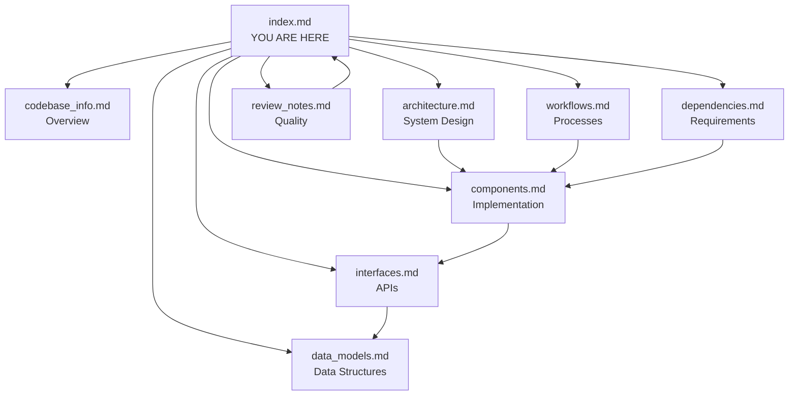

# PDF Accessibility Solutions - Knowledge Base Index

## 🤖 Instructions for AI Assistants

This index serves as your primary entry point for understanding the PDF Accessibility Solutions codebase. Each document below contains rich metadata and detailed information about specific aspects of the system.

**How to Use This Index**:
1. **Start Here**: Read the summaries below to understand which documents contain relevant information
2. **Navigate Efficiently**: Use the metadata tags to quickly find specific topics
3. **Deep Dive**: Reference the full documents only when you need detailed implementation information
4. **Cross-Reference**: Documents are interconnected - follow references between them

**Key Principle**: This index contains sufficient metadata for you to answer most questions without reading full documents. Only access detailed documents when you need specific implementation details, code examples, or technical specifications.

---

## 📚 Document Catalog

### 1. Codebase Information
**File**: `codebase_info.md`  
**Purpose**: High-level overview of the codebase structure, statistics, and technology stack  
**When to Use**: Understanding project scope, technology choices, repository organization

**Key Topics**:
- Project statistics (140 files, 27,949 LOC)
- Language distribution (Python 95 files, JavaScript 3, Java 2, Shell 2)
- Technology stack (AWS CDK, Lambda, ECS, Bedrock, S3)
- Repository structure and organization
- Development environment requirements
- Supported standards (WCAG 2.1 Level AA, PDF/UA)

**Metadata Tags**: `#overview` `#statistics` `#technology-stack` `#repository-structure`

**Quick Facts**:
- Two main solutions: PDF-to-PDF and PDF-to-HTML
- Built by Arizona State University's AI Cloud Innovation Center
- Serverless architecture on AWS
- Python 3.12, Node.js 18, Java 11 runtimes

---

### 2. Architecture
**File**: `architecture.md`  
**Purpose**: System architecture, component interactions, and design patterns  
**When to Use**: Understanding system design, data flow, infrastructure, scalability

**Key Topics**:
- High-level architecture diagrams (Mermaid)
- PDF-to-PDF solution workflow (S3 → Lambda → Step Functions → ECS → Merger)
- PDF-to-HTML solution workflow (S3 → Lambda → BDA → Bedrock → Remediation)
- VPC configuration and networking
- ECS Fargate setup
- CloudWatch monitoring architecture
- Deployment architecture
- Scalability and cost optimization strategies

**Metadata Tags**: `#architecture` `#design-patterns` `#infrastructure` `#workflows` `#scalability`

**Key Diagrams**:
- Overall system architecture
- PDF-to-PDF sequence diagram
- PDF-to-HTML sequence diagram
- Monitoring architecture
- Deployment flow

**Design Patterns**:
- Event-driven architecture
- Serverless-first
- Infrastructure as Code (CDK)
- Observability-first

---

### 3. Components
**File**: `components.md`  
**Purpose**: Detailed descriptions of all system components, their responsibilities, and interactions  
**When to Use**: Understanding specific components, debugging, extending functionality

**Key Topics**:
- **PDF-to-PDF Components**:
  - PDF Splitter Lambda (splits PDFs into pages)
  - Adobe Autotag Container (adds accessibility tags)
  - Alt Text Generator Container (generates image descriptions)
  - Title Generator Lambda (creates document titles)
  - PDF Merger Lambda (Java, merges processed chunks)
  - Accessibility Checkers (pre/post validation)
  - Step Functions Orchestrator (workflow coordination)

- **PDF-to-HTML Components**:
  - PDF2HTML Lambda Function (main pipeline)
  - Bedrock Data Automation Client (PDF parsing)
  - Accessibility Auditor (WCAG compliance checking)
  - Remediation Manager (fixes accessibility issues)
  - Report Generator (creates detailed reports)
  - Usage Tracker (cost and metrics tracking)

- **Shared Components**:
  - Metrics Helper (CloudWatch metrics)
  - S3 Object Tagger (user attribution)
  - CloudWatch Dashboard (visualization)

**Metadata Tags**: `#components` `#lambda` `#ecs` `#step-functions` `#auditing` `#remediation`

**Component Dependencies**: Includes dependency graph showing relationships between components

---

### 4. Interfaces and APIs
**File**: `interfaces.md`  
**Purpose**: API specifications, data contracts, and integration points  
**When to Use**: Integrating with the system, understanding API contracts, debugging API calls

**Key Topics**:
- **External APIs**:
  - Adobe PDF Services API (Autotag, Extract)
  - AWS Bedrock API (Nova Pro model)
  - AWS Bedrock Data Automation API

- **Internal APIs**:
  - Content Accessibility Utility API
  - Audit API
  - Remediation API

- **AWS Service Interfaces**:
  - S3 operations
  - CloudWatch metrics and logs
  - Secrets Manager
  - Step Functions

- **Data Models**: AuditReport, RemediationReport, AuditIssue, RemediationFix
- **Event Schemas**: S3 events, Step Functions input/output
- **Error Responses**: Standard error format and codes

**Metadata Tags**: `#apis` `#interfaces` `#data-contracts` `#integration` `#events`

**API Examples**: Includes request/response examples for all major APIs

---

### 5. Data Models
**File**: `data_models.md`  
**Purpose**: Data structures, schemas, and type definitions  
**When to Use**: Understanding data formats, implementing new features, parsing outputs

**Key Topics**:
- **Audit Models**: AuditReport, AuditSummary, AuditIssue, Location
- **Remediation Models**: RemediationReport, RemediationSummary, RemediationFix, RemediationDetails
- **Configuration Models**: Config with WCAG levels and options
- **Usage Tracking Models**: UsageData with cost estimates
- **BDA Models**: BDAElement, BDAPage
- **Metrics Models**: MetricData with dimensions
- **WCAG Criteria Mapping**: Complete mapping of WCAG 2.1 Level AA criteria
- **File Formats**: JSON schemas for reports and usage data
- **Database Schemas**: SQLite schema for image metadata
- **Enumerations**: Severity, IssueStatus, RemediationStatus

**Metadata Tags**: `#data-models` `#schemas` `#types` `#wcag` `#reports`

**Issue Types**: Complete list of 20+ accessibility issue types with WCAG mappings

---

### 6. Workflows
**File**: `workflows.md`  
**Purpose**: End-to-end process flows and operational procedures  
**When to Use**: Understanding process flows, troubleshooting, optimizing performance

**Key Topics**:
- **PDF-to-PDF Workflow**: 8-step process from upload to compliant PDF
  - Upload → Split → Pre-check → Parallel Processing → Title → Post-check → Merge → Output
  - Processing time: 3-60 minutes depending on size

- **PDF-to-HTML Workflow**: 7-step process from upload to remediated HTML
  - Upload → BDA Conversion → Audit → Remediation → Report → Package → Output
  - Processing time: 1-20 minutes depending on size

- **Deployment Workflow**: One-click and manual deployment processes
- **Error Handling Workflows**: Retry logic and recovery procedures
- **Monitoring Workflow**: Metrics collection and log aggregation
- **Cost Tracking Workflow**: Per-user cost attribution

**Metadata Tags**: `#workflows` `#processes` `#deployment` `#error-handling` `#monitoring`

**Timing Information**: Detailed timing for each workflow step

---

### 7. Dependencies
**File**: `dependencies.md`  
**Purpose**: External services, libraries, and version requirements  
**When to Use**: Setting up development environment, troubleshooting dependency issues, updating versions

**Key Topics**:
- **External Services**:
  - Adobe PDF Services API (enterprise contract required)
  - AWS Bedrock (IAM-based, Nova Pro model)
  - AWS Bedrock Data Automation (per-page pricing)

- **AWS Services**: S3, Lambda, ECS, Step Functions, ECR, Secrets Manager, CloudWatch, VPC, IAM, CodeBuild

- **Python Dependencies**: boto3, aws-cdk-lib, pypdf, PyMuPDF, beautifulsoup4, lxml, Pillow, pdfservices-sdk

- **JavaScript Dependencies**: AWS SDK, pdf-lib, CDK libraries

- **Java Dependencies**: Apache PDFBox, AWS SDK

- **Version Compatibility**: Python 3.9+, Node.js 18+, Java 11+

- **Security Considerations**: Dependency scanning, license compliance, supply chain security

**Metadata Tags**: `#dependencies` `#libraries` `#versions` `#external-services` `#security`

**Pricing Information**: Detailed pricing for all AWS services and external APIs

---

### 8. Review Notes
**File**: `review_notes.md`  
**Purpose**: Documentation quality assessment, identified gaps, and recommendations  
**When to Use**: Understanding documentation completeness, planning improvements

**Key Topics**:
- **Consistency Check**: Identified inconsistencies (language diversity, metrics duplication)
- **Completeness Check**: Well-documented areas and gaps
- **Language Support**: All languages fully supported
- **Documentation Quality**: Strengths and areas for improvement
- **Recommendations**: Short, medium, and long-term improvements
- **Validation Checklist**: Coverage assessment
- **Priority Gaps**: Testing strategy, security best practices, troubleshooting

**Metadata Tags**: `#review` `#quality` `#gaps` `#recommendations` `#maintenance`

**Action Items**: Prioritized list of documentation improvements needed

---

## 🔍 Quick Reference Guide

### For Understanding the System
1. Start with **Codebase Information** for overview
2. Read **Architecture** for system design
3. Review **Components** for detailed component information

### For Development
1. Check **Dependencies** for setup requirements
2. Review **Components** for implementation details
3. Reference **Data Models** for data structures
4. Follow **Workflows** for process understanding

### For Integration
1. Read **Interfaces and APIs** for API contracts
2. Review **Data Models** for data formats
3. Check **Dependencies** for external service requirements

### For Operations
1. Review **Workflows** for operational procedures
2. Check **Architecture** for infrastructure details
3. Reference **Components** for troubleshooting

### For Troubleshooting
1. Check **Review Notes** for known issues
2. Review **Workflows** for error handling
3. Reference **Components** for component-specific issues
4. Check **Dependencies** for version compatibility

---

## 🏷️ Metadata Tag Index

### By Topic
- **Architecture**: `architecture.md`
- **Components**: `components.md`
- **APIs**: `interfaces.md`
- **Data**: `data_models.md`
- **Processes**: `workflows.md`
- **Dependencies**: `dependencies.md`
- **Quality**: `review_notes.md`

### By Technology
- **AWS Services**: `architecture.md`, `components.md`, `dependencies.md`
- **Python**: `codebase_info.md`, `components.md`, `dependencies.md`
- **JavaScript**: `codebase_info.md`, `components.md`, `dependencies.md`
- **Java**: `codebase_info.md`, `components.md`, `dependencies.md`

### By Use Case
- **Development**: `codebase_info.md`, `components.md`, `data_models.md`, `dependencies.md`
- **Operations**: `architecture.md`, `workflows.md`, `components.md`
- **Integration**: `interfaces.md`, `data_models.md`, `dependencies.md`
- **Troubleshooting**: `review_notes.md`, `workflows.md`, `components.md`

---

## 📊 Key Statistics

- **Total Files**: 140
- **Lines of Code**: 27,949
- **Components**: 17 major components
- **AWS Services**: 13 services used
- **External APIs**: 3 (Adobe, Bedrock, BDA)
- **Supported Languages**: Python, JavaScript, Java, Shell
- **WCAG Criteria**: 10+ Level AA criteria supported
- **Issue Types**: 20+ accessibility issue types

---

## 🔗 Cross-References

### Architecture ↔ Components
- Architecture describes high-level design
- Components provide implementation details
- Both reference same component names

### Components ↔ Interfaces
- Components describe functionality
- Interfaces define API contracts
- Both use same data models

### Interfaces ↔ Data Models
- Interfaces reference data models
- Data Models define structures used in APIs
- Both include JSON examples

### Workflows ↔ Components
- Workflows describe process flows
- Components implement workflow steps
- Both reference same operations

### Dependencies ↔ All Documents
- Dependencies lists all external requirements
- All documents reference dependencies
- Version compatibility documented

---

## 💡 Tips for AI Assistants

### Answering Architecture Questions
→ Start with `architecture.md` for system design  
→ Reference `components.md` for specific component details  
→ Check `workflows.md` for process flows

### Answering API Questions
→ Start with `interfaces.md` for API specifications  
→ Reference `data_models.md` for data structures  
→ Check `components.md` for implementation details

### Answering Development Questions
→ Start with `codebase_info.md` for overview  
→ Reference `dependencies.md` for setup requirements  
→ Check `components.md` for implementation guidance

### Answering Operational Questions
→ Start with `workflows.md` for procedures  
→ Reference `architecture.md` for infrastructure  
→ Check `review_notes.md` for known issues

### Answering Troubleshooting Questions
→ Start with `review_notes.md` for known issues  
→ Reference `workflows.md` for error handling  
→ Check `components.md` for component-specific details

---

## 📝 Document Relationships

---

## 🎯 Common Questions and Where to Find Answers

**Q: How does the PDF-to-PDF solution work?**  
→ `architecture.md` (high-level) → `workflows.md` (detailed process) → `components.md` (implementation)

**Q: What accessibility checks are performed?**  
→ `components.md` (Auditor section) → `data_models.md` (issue types) → `interfaces.md` (API)

**Q: How do I deploy the system?**  
→ `workflows.md` (deployment workflow) → `dependencies.md` (requirements) → `codebase_info.md` (overview)

**Q: What AWS services are used?**  
→ `dependencies.md` (complete list) → `architecture.md` (how they're used) → `components.md` (specific usage)

**Q: How is cost tracked?**  
→ `workflows.md` (cost tracking workflow) → `components.md` (Usage Tracker) → `data_models.md` (UsageData)

**Q: What are the data models?**  
→ `data_models.md` (complete definitions) → `interfaces.md` (API usage) → `components.md` (implementation)

**Q: How do I troubleshoot errors?**  
→ `review_notes.md` (known issues) → `workflows.md` (error handling) → `components.md` (component details)

**Q: What external APIs are used?**  
→ `dependencies.md` (service list) → `interfaces.md` (API specs) → `components.md` (usage)

---

## 📅 Documentation Metadata

**Generated**: 2026-03-02  
**Generator**: AI Documentation System  
**Codebase Version**: Git commit `8d6102bc644641c94f5a695a32ea50c19b3c8d68`  
**Documentation Version**: 1.0  
**Last Updated**: 2026-03-02  
**Next Review**: Recommended within 30 days

---

## 🚀 Getting Started Paths

### Path 1: New Developer
1. Read `codebase_info.md` - Understand the project
2. Read `architecture.md` - Learn the system design
3. Review `dependencies.md` - Set up your environment
4. Explore `components.md` - Understand the code

### Path 2: Integration Developer
1. Read `interfaces.md` - Understand the APIs
2. Review `data_models.md` - Learn the data formats
3. Check `dependencies.md` - Understand requirements
4. Reference `workflows.md` - Understand processes

### Path 3: Operations Engineer
1. Read `architecture.md` - Understand infrastructure
2. Review `workflows.md` - Learn operational procedures
3. Check `components.md` - Understand components
4. Reference `review_notes.md` - Know the issues

### Path 4: AI Assistant
1. Read this index completely
2. Use metadata tags to navigate
3. Reference specific documents only when needed
4. Cross-reference between documents for complete answers

---

**Remember**: This index is designed to minimize the need to read full documents. Use the summaries and metadata to answer questions efficiently, and only dive into detailed documents when you need specific implementation information.
