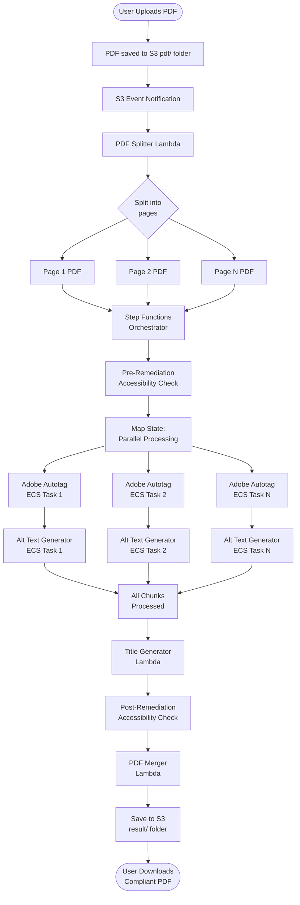
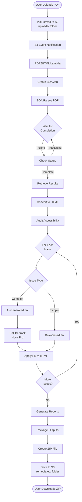
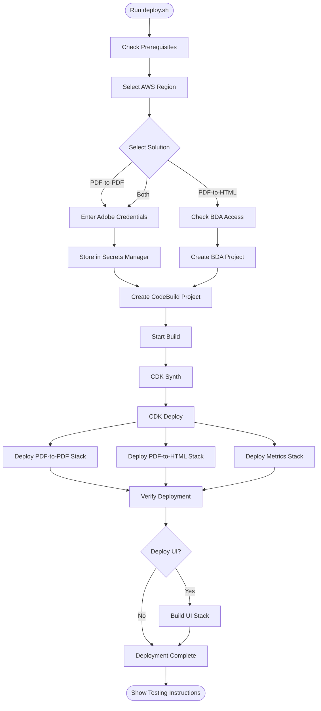
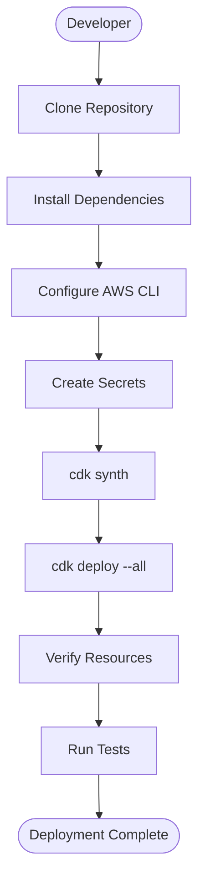
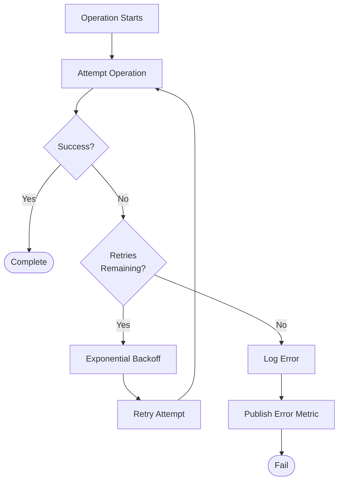
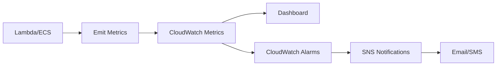
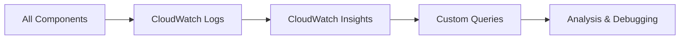
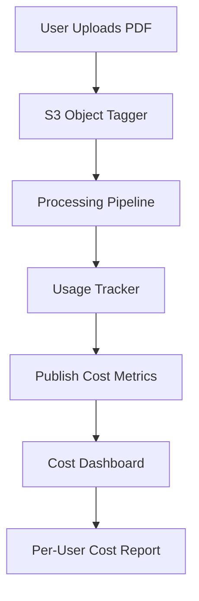

# Key Workflows and Processes

## PDF-to-PDF Remediation Workflow

### End-to-End Process

### Detailed Steps

#### 1. Upload and Trigger (0-5 seconds)
- User uploads PDF to S3 `pdf/` folder
- S3 generates PUT event notification
- Event triggers PDF Splitter Lambda
- S3 Object Tagger adds user metadata

#### 2. PDF Splitting (5-30 seconds)
- Lambda downloads PDF from S3
- Splits PDF into individual pages using pypdf
- Uploads each page to `temp/` folder
- Publishes metrics (pages processed, file size)
- Triggers Step Functions with chunk list

#### 3. Pre-Remediation Check (10-20 seconds)
- Lambda downloads original PDF
- Runs accessibility audit
- Generates baseline report
- Saves report to S3

#### 4. Parallel Chunk Processing (2-10 minutes per chunk)

**Map State Configuration**:
- Max concurrency: 10
- Retry attempts: 3
- Timeout: 30 minutes per chunk

**For Each Chunk**:

##### 4a. Adobe Autotag (1-5 minutes)
- ECS Fargate task starts
- Downloads chunk from S3
- Retrieves Adobe credentials from Secrets Manager
- Calls Adobe Autotag API
  - Adds structure tags (headings, lists, tables)
  - Identifies reading order
- Calls Adobe Extract API
  - Extracts images
  - Generates image metadata Excel file
- Creates SQLite database with image info
- Uploads tagged PDF to S3
- Publishes metrics (API calls, duration)

##### 4b. Alt Text Generation (1-5 minutes)
- ECS Fargate task starts
- Downloads tagged PDF and image metadata
- For each image:
  - Extracts surrounding text context
  - Determines if decorative or informative
  - If informative:
    - Encodes image as base64
    - Calls Bedrock Nova Pro with image + context
    - Receives AI-generated alt text
  - Embeds alt text in PDF structure
- Uploads final PDF to S3
- Publishes metrics (Bedrock calls, tokens)

#### 5. Title Generation (30-60 seconds)
- Lambda downloads first processed chunk
- Extracts text from first few pages
- Calls Bedrock Nova Pro with prompt
- Receives generated title
- Embeds title in PDF metadata
- Saves updated PDF

#### 6. Post-Remediation Check (10-20 seconds)
- Lambda downloads processed PDF
- Runs accessibility audit
- Compares with pre-check results
- Generates compliance report
- Saves report to S3

#### 7. PDF Merging (30-120 seconds)
- Java Lambda starts
- Downloads all processed chunks
- Merges in correct page order using Apache PDFBox
- Adds "COMPLIANT" prefix to filename
- Uploads to `result/` folder
- Publishes completion metrics

#### 8. Notification and Cleanup
- User receives notification (if UI deployed)
- Temporary files remain in `temp/` folder
- Optional: S3 lifecycle policy cleans up temp files after 7 days

### Total Processing Time
- **Small PDF (1-10 pages)**: 3-8 minutes
- **Medium PDF (11-50 pages)**: 8-20 minutes
- **Large PDF (51-200 pages)**: 20-60 minutes

---

## PDF-to-HTML Remediation Workflow

### End-to-End Process

### Detailed Steps

#### 1. Upload and Trigger (0-5 seconds)
- User uploads PDF to S3 `uploads/` folder
- S3 generates PUT event notification
- Event triggers PDF2HTML Lambda (container)
- S3 Object Tagger adds user metadata

#### 2. PDF to HTML Conversion (30-120 seconds)

##### 2a. BDA Job Creation
- Lambda calls Bedrock Data Automation API
- Creates async parsing job
- Receives job ID

##### 2b. BDA Processing
- BDA parses PDF structure
- Extracts text with layout information
- Identifies images, tables, headings
- Generates structured JSON output
- Saves to S3 output location

##### 2c. Status Polling
- Lambda polls BDA job status every 5 seconds
- Timeout: 5 minutes
- On completion, retrieves results

##### 2d. HTML Generation
- Lambda processes BDA JSON output
- Builds HTML structure from elements
- Preserves layout and styling
- Copies images to output directory
- Saves initial HTML to `output/result.html`

#### 3. Accessibility Audit (10-30 seconds)

##### 3a. HTML Parsing
- Loads HTML with BeautifulSoup
- Builds DOM tree

##### 3b. Check Execution
- Runs all accessibility checks:
  - Image checks (alt text)
  - Heading checks (hierarchy)
  - Table checks (headers, captions)
  - Form checks (labels, fieldsets)
  - Link checks (descriptive text)
  - Structure checks (landmarks, language)
  - Color contrast checks

##### 3c. Issue Collection
- Collects all issues with:
  - Element selector
  - WCAG criteria
  - Severity level
  - Suggested fix
- Generates audit report

#### 4. Remediation (1-5 minutes)

##### 4a. Issue Prioritization
- Groups issues by type
- Prioritizes critical issues
- Determines remediation strategy

##### 4b. Rule-Based Fixes (Simple Issues)
**Examples**:
- Add missing `lang` attribute
- Add `main` landmark
- Fix heading hierarchy
- Add table `scope` attributes
- Associate form labels

**Process**:
- Apply predefined transformation
- Update HTML DOM
- Mark issue as fixed

##### 4c. AI-Generated Fixes (Complex Issues)
**Examples**:
- Generate alt text for images
- Create table captions
- Improve link text
- Generate document title

**Process**:
1. Extract element and context
2. Build AI prompt with:
   - Issue description
   - Element HTML
   - Surrounding context
   - WCAG guidance
3. Call Bedrock Nova Pro
4. Parse AI response
5. Apply fix to HTML
6. Validate fix
7. Mark issue as fixed or manual review

##### 4d. Manual Review Items
**Flagged for Manual Review**:
- Complex table structures
- Ambiguous image context
- Color contrast requiring design changes
- Structural changes affecting layout

#### 5. Report Generation (5-15 seconds)

##### 5a. HTML Report
- Interactive report with:
  - Summary statistics
  - Issue breakdown by severity
  - WCAG criteria mapping
  - Before/after comparisons
  - Manual review items
- Styled with CSS
- JavaScript for filtering

##### 5b. JSON Report
- Machine-readable format
- Complete issue details
- Remediation actions
- Usage statistics

##### 5c. Usage Data
- Bedrock invocations and tokens
- BDA processing time
- Cost estimates
- Processing metrics

#### 6. Packaging and Output (5-10 seconds)

##### 6a. File Collection
- `remediated.html`: Final accessible HTML
- `result.html`: Original conversion (before remediation)
- `images/`: Extracted images with alt text
- `remediation_report.html`: Detailed report
- `usage_data.json`: Usage statistics

##### 6b. ZIP Creation
- Creates `final_{filename}.zip`
- Includes all output files
- Preserves directory structure

##### 6c. S3 Upload
- Uploads ZIP to `remediated/` folder
- Sets appropriate metadata
- Publishes completion metrics

#### 7. Cleanup
- Removes temporary files
- Logs completion
- Returns success response

### Total Processing Time
- **Small PDF (1-10 pages)**: 1-3 minutes
- **Medium PDF (11-50 pages)**: 3-8 minutes
- **Large PDF (51-200 pages)**: 8-20 minutes

---

## Deployment Workflow

### One-Click Deployment (deploy.sh)

### Manual Deployment

---

## Error Handling Workflows

### Retry Logic

**Retry Configuration**:
- Max attempts: 3
- Backoff rate: 2.0
- Initial delay: 1 second
- Max delay: 60 seconds

### Error Recovery

#### Adobe API Failure
1. Log error to CloudWatch
2. Publish error metric
3. Retry with exponential backoff
4. If all retries fail:
   - Mark chunk as failed
   - Continue with other chunks
   - Generate partial result

#### Bedrock Throttling
1. Detect throttling error
2. Implement exponential backoff
3. Reduce request rate
4. Retry operation
5. If persistent:
   - Fall back to rule-based fixes
   - Flag for manual review

#### BDA Timeout
1. Cancel BDA job
2. Retry with smaller page range
3. If timeout persists:
   - Process pages individually
   - Combine results

---

## Monitoring Workflow

### Metrics Collection

### Log Aggregation

---

## Cost Tracking Workflow

**Cost Attribution**:
1. S3 object tagged with user ID
2. All operations track user ID
3. Metrics published with user dimension
4. Dashboard aggregates by user
5. Monthly cost reports generated
